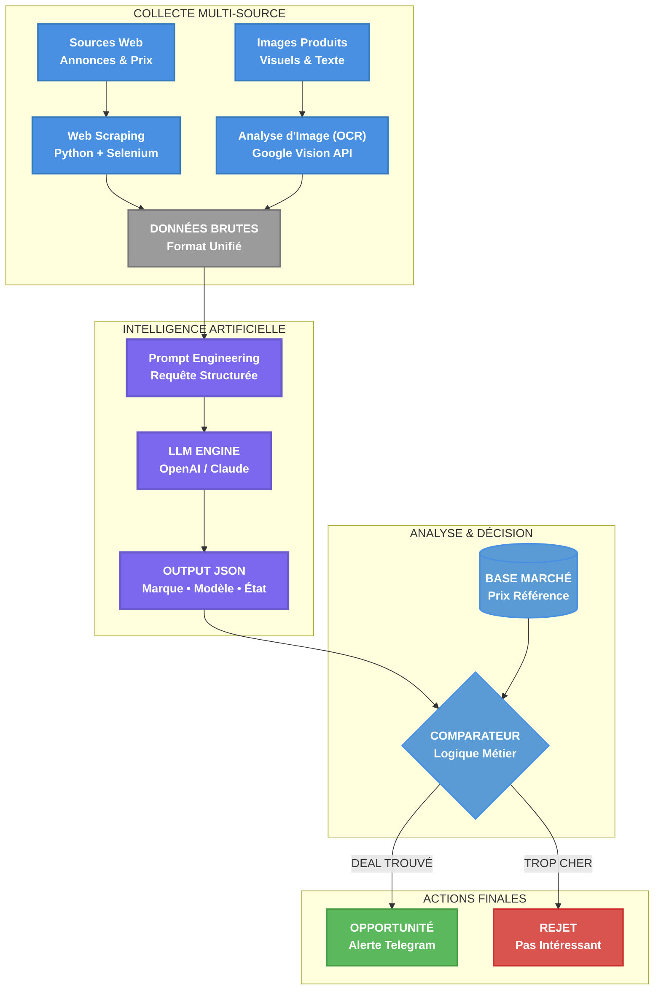

  

# Benjamin Koensgen

## Ingénieur R&D en IA & Robotique

Mon travail est guidé par un principe : un modèle, qu'il soit d'IA ou de physique, ne révèle sa vraie valeur qu'une fois confronté à la réalité brute et imprévisible du monde réel. C'est cette confrontation qui me passionne.

Il y a un an, j'ai quitté mon poste pour me consacrer entièrement à la maîtrise du cycle complet de la robotique moderne : du "cerveau" logiciel à son incarnation dans un "corps" physique.

---

## Projets & Réalisations

Chaque projet a été un laboratoire pour résoudre le même défi fondamental : comment construire un pont robuste entre un modèle parfait et une réalité imparfaite.

### Projet Robo-Pointer : Donner un Corps à l'Intelligence

*(LIEN VERS UNE VIDÉO DE DÉMONSTRATION ICI)*

> Ce projet a été mon champ de bataille avec la physique. Ma première tentative de contrôle, basée sur une logique simple, a donné un résultat chaotique : un robot instable, aux mouvements erratiques. Cette "douleur" a été la meilleure des leçons. Elle m'a forcé à aller au-delà du code pour doter le logiciel d'une véritable **compréhension de son propre corps**.
>
> La solution a été de centraliser l'intelligence dans un contrôleur qui modélise la cinématique du bras, qui respecte ses limites articulaires, et qui **compense activement une force bien réelle : la gravité**. C'est le passage concret de la commande naïve à la physique appliquée, transformant l'instabilité en un suivi contrôlé.

**Technologies :** `ROS 2` `Python` `OpenCV` `YOLOv8` `Conception CAO` `Impression 3D`

**[Voir le code et l'architecture sur GitHub →](https://github.com/bkoensgen/robo-pointer-so100)**

### Projet AudioBuy : Dompter le Chaos des Données du Monde Réel

> Ce projet n'était pas un simple exercice d'appel à une API. C'était une immersion dans le problème le plus courant et le plus critique des systèmes d'IA : la **qualité des données du monde réel, qui sont par nature sales, incomplètes et non-structurées**. J'ai bâti une pipeline complète pour transformer ce chaos en une structure exploitable.
>
> Mais la leçon la plus importante a été de traiter le LLM non pas comme une boîte magique, mais comme un **outil probabiliste**. Le composant le plus critique de ce projet n'est donc pas le LLM lui-même, mais le **benchmark sur-mesure que j'ai créé pour quantifier la confiance** dans ses résultats. C'est ce qui garantit qu'aucune décision économique n'est prise sur la base d'une donnée incertaine.

**Technologies :** `Python` `LLMs (OpenAI API)` `Web Scraping` `Google Vision (OCR)` `Bases de Données (SQL)`

**[Voir la présentation technique sur GitHub →](https://github.com/bkoensgen/Audiobuy-showcase)**

### Contribution Nav2 : Confronter le Logiciel à la Réalité Énergétique

> Un système de navigation robotique, aussi parfait soit-il en simulation, se heurte à une contrainte physique inévitable : **une batterie qui se vide**. Le paradigme "toujours actif" de la perception est un luxe que les robots en mission ne peuvent pas se permettre.
>
> Face à ce problème de surconsommation, ma contribution a été de concevoir et d'implémenter une nouvelle API au cœur de Nav2, un standard mondial de la robotique. Cette solution permet une **activation à la demande des processus de détection**, optimisant ainsi drastiquement les ressources (CPU, énergie) sans compromettre la performance de la mission.

**Technologies :** `C++` `ROS 2` `Architecture Logicielle` `Tests Unitaires (GTest)`

**[Voir la Pull Request sur GitHub (#5218) →](https://github.com/ros-navigation/navigation2/pull/5218)**

---

## Contact & Liens

Je suis toujours ouvert à discuter de défis techniques passionnants.

[LinkedIn](https://www.linkedin.com/in/benjamin-koensgen) | [GitHub](https://github.com/bkoensgen) | [E-mail](mailto:bkoensgen@gmail.com)
