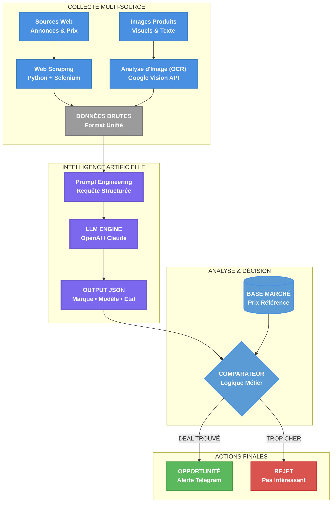

  

# Benjamin Koensgen

## Ingénieur R&D en IA & Robotique

Mon travail se concentre sur un seul défi : faire interagir des systèmes logiciels avec un monde physique désordonné et imprévisible.

Il y a un an, j'ai mis ma carrière en pause pour construire, par la pratique, les deux piliers de ce domaine : le "cerveau" logiciel qui traite l'information, et le "corps" robotique qui agit sur cette information.

---

## Projets & Réalisations

Chaque projet a été une occasion d'apprendre à faire le pont entre un plan parfait et une réalité qui ne l'est jamais.

### Projet Robo-Pointer : Apprendre la Physique par la Pratique

*(LIEN VERS UNE VIDÉO DE DÉMONSTRATION ICI)*

> Ce projet a commencé avec un objectif simple et une réalité humiliante : mon robot était complètement instable. Une boucle de contrôle basique ne suffisait pas. Les mouvements étaient erratiques et imprévisibles.
>
> La seule façon d'avancer était d'enseigner un peu de physique au logiciel. J'ai dû concevoir un contrôleur centralisé qui comprenait la géométrie du bras (sa cinématique) et qui pouvait **compenser activement la force de la gravité**. Le simple fait d'ajouter ce modèle physique interne a transformé les oscillations chaotiques en un mouvement contrôlé et dirigé.

**Technologies :** `ROS 2` `Python` `OpenCV` `YOLOv8` `Conception CAO` `Impression 3D`

**[Voir le code et l'architecture sur GitHub →](https://github.com/bkoensgen/robo-pointer-so100)**

### Projet AudioBuy : Extraire un Signal Clair du Bruit

> Ma première épreuve a été de dompter le chaos des annonces en ligne. Les données étaient un mélange de textes et d'images, pleines de fautes de frappe, d'informations manquantes et d'incohérences.
>
> Le cœur du projet n'a pas été de simplement utiliser un LLM, mais d'apprendre à s'en méfier. Parce que ces modèles sont probabilistes, j'ai réalisé que l'étape la plus critique était la validation. J'ai donc bâti mon propre **benchmark pour répondre à une question simple : "Puis-je faire confiance à ce résultat ?"**. Cela garantit qu'une décision économique n'est jamais prise sur une donnée dont la fiabilité n'a pas été mesurée.

**Technologies :** `Python` `LLMs (OpenAI API)` `Web Scraping` `Google Vision (OCR)` `Bases de Données (SQL)`

**[Voir la présentation technique sur GitHub →](https://github.com/bkoensgen/Audiobuy-showcase)**

### Contribution Nav2 : Adapter le Logiciel aux Contraintes du Monde Réel

> En simulation, un robot peut se permettre d'avoir tous ses capteurs actifs en permanence. Dans le monde réel, cette approche se heurte à une contrainte simple : **la durée de vie d'une batterie**.
>
> Mon travail sur Nav2, un standard de la navigation robotique, a été de résoudre ce conflit. J'ai conçu et intégré une nouvelle API permettant au système de **piloter l'activation des capteurs à la demande**. Cette modification, au cœur du framework, s'attaque directement au problème de la consommation énergétique, un enjeu majeur pour les systèmes autonomes déployés sur le terrain.

**Technologies :** `C++` `ROS 2` `Architecture Logicielle` `Tests Unitaires (GTest)`

**[Voir la Pull Request sur GitHub (#5218) →](https://github.com/ros-navigation/navigation2/pull/5218)**

---

## Contact & Liens

Je suis toujours ouvert à discuter de défis techniques passionnants.

[LinkedIn](https://www.linkedin.com/in/benjamin-koensgen) | [GitHub](https://github.com/bkoensgen) | [E-mail](mailto:bkoensgen@gmail.com)
