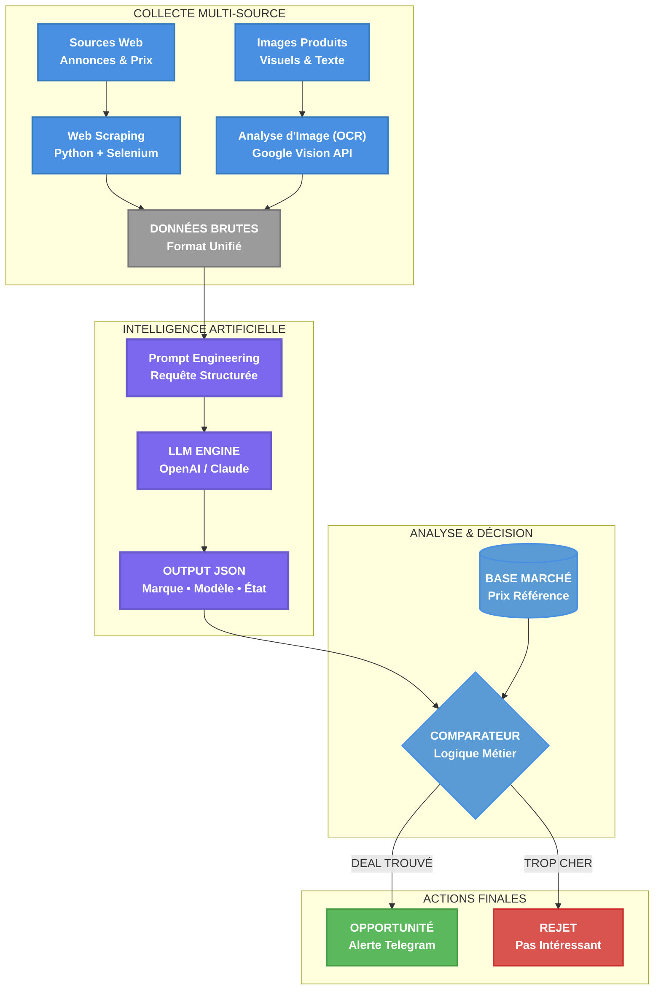

<p align="center">
  
</p>

# Benjamin Koensgen

## Ingénieur en Intelligence Artificielle & Robotique

*De la conception de pipelines IA à leur incarnation physique en robotique.*

---

J'ai quitté mon poste avec une conviction : je devais maîtriser par moi-même les technologies d'IA qui commençaient à tout redéfinir. Mon approche a été simple : d'abord le "cerveau" logiciel, puis le "corps" physique.

---

## Projets & Réalisations

Ici, un aperçu des projets concrets qui ont marqué ce parcours de R&D.

### Projet Robo-Pointer : Cycle Complet de la Mécatronique

<a href="[LIEN VIDÉO YOUTUBE/VIMEO]" target="_blank">
  
</a>

> J'ai conçu, imprimé en 3D et assemblé ce bras 6-axes, puis développé le pipeline ROS 2 de A à Z pour le contrôle et le suivi d'objet par vision. C'est la démonstration de ma capacité à gérer l'intégralité du cycle mécatronique.

**Technologies :** `ROS 2` `C++` `Python` `OpenCV` `Conception CAO (SolidWorks/Inventor)` `Impression 3D`

**[Voir le code et la documentation sur GitHub →](https://github.com/bkoensgen/robo-pointer-so100)**

### Projet AudioBuy : Pipeline de Données et Analyse par LLM



> Un système autonome développé pour identifier des opportunités de marché en temps réel. Le pipeline scrape les données (texte et images), les analyse via un LLM pour en extraire la structure, et les compare à une base de données de prix pour une décision automatisée.

**Technologies :** `Python` `LLMs (OpenAI API)` `Web Scraping` `Google Vision (OCR)` `Bases de Données (SQL)`

**[Voir la présentation technique sur GitHub →](https://github.com/bkoensgen/Audiobuy-showcase)**

### Contribution Nav2 : Optimisation des Ressources en Robotique Pro

Pour résoudre un problème de surconsommation énergétique dans un standard mondial de la robotique, j'ai conçu et implémenté une nouvelle API au cœur de Nav2. Cette solution permet d'activer les nœuds de détection uniquement lorsque c'est nécessaire, optimisant ainsi drastiquement les ressources (CPU, batterie) des robots en mission.

Ci-dessous, un extrait de la modification apportée au cœur du serveur de docking, montrant l'ajout des appels pour démarrer et arrêter le processus de détection.

```diff
// Extrait de nav2_docking/opennav_docking/src/docking_server.cpp

void DockingServer::doInitialPerception(Dock * dock, geometry_msgs::msg::PoseStamped & dock_pose)
{
  publishDockingFeedback(DockRobot::Feedback::INITIAL_PERCEPTION);

+ if (!dock->plugin->startDetectionProcess()) {
+   throw opennav_docking_core::FailedToDetectDock("Failed to start the detection process.");
+ }

  rclcpp::Rate loop_rate(controller_frequency_);
  auto start = this->now();
  auto timeout = rclcpp::Duration::from_seconds(initial_perception_timeout_);
  while (!dock->plugin->getRefinedPose(dock_pose, dock->id)) {
    if (this->now() - start > timeout) {
      throw opennav_docking_core::FailedToDetectDock(
        "Failed initial dock detection: Timeout exceeded");
    }
// ... (code de la boucle)
}
```

> Face à une problématique de surconsommation énergétique dans un standard mondial de la robotique, j'ai conçu et implémenté une nouvelle API au cœur de Nav2. Cette solution permet d'activer les nœuds de détection uniquement lorsque c'est nécessaire, optimisant ainsi drastiquement les ressources (CPU, batterie) des robots en mission.

**Technologies :** `C++` `ROS 2` `Architecture Logicielle` `Tests Unitaires (GTest)`

**[Voir la Pull Request sur GitHub (#5218) →](https://github.com/ros-navigation/navigation2/pull/5218)**

---

## Contact & Liens

N'hésitez pas à me contacter.

[LinkedIn](https://www.linkedin.com/in/benjamin-koensgen) | [GitHub](https://github.com/bkoensgen) | [E-mail](mailto:bkoensgen@gmail.com)